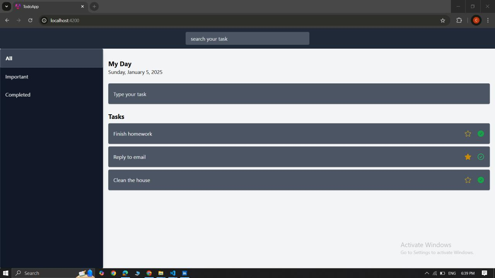
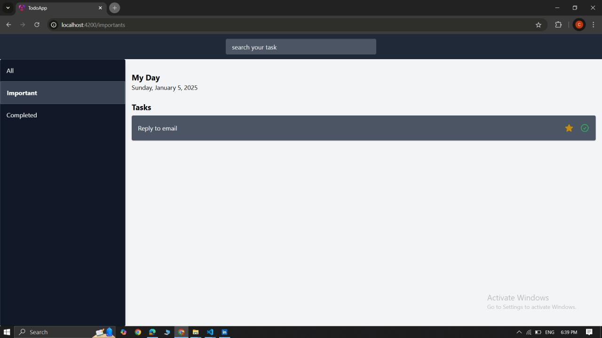
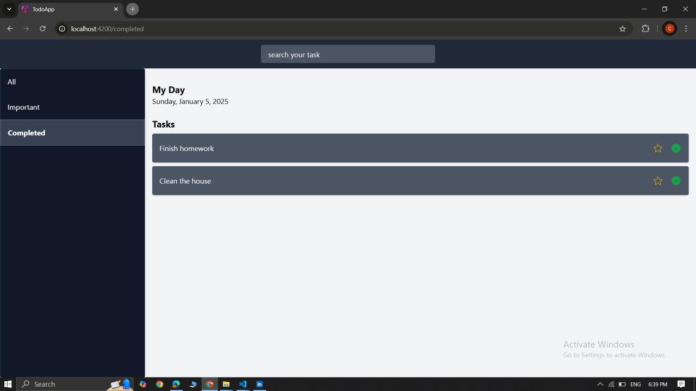

# ✅ To-Do App

A sleek and intuitive **To-Do Application** built using **Angular** to simplify daily task management. This project helps users organize tasks efficiently by categorizing, completing, and prioritizing their activities through a clean and responsive interface.

---

## 📅 Project Duration

**January 2025 – January 2025**

---

## 🚀 Features

### 📝 Task Management

- Create and manage tasks easily
- Organize tasks into different categories
- Mark tasks as completed
- Mark important tasks for priority handling
- Simple and user-friendly interface

---

## 🛠️ Technologies Used

- Angular
- TypeScript
- HTML5
- SCSS
- Tailwind CSS
- JSON Server

---

## 📸 Screenshots

### 🏠 All Tasks Page



---

### ⭐ Important Tasks Page



---

### ✅ Completed Tasks Page



---

## 📂 Project Structure

```
todo_app/
│
├── src/
├── db.json
├── angular.json
├── package.json
├── tailwind.config.js
├── images/
│   ├── image1.png
│   ├── image2.png
│   └── image3.png
└── README.md
```

---

## ⚙️ Installation

Clone the repository:

```bash
git clone https://github.com/chamodi12345/todo_app.git
```

Navigate to the project folder:

```bash
cd todo_app
```

Install dependencies:

```bash
npm install
```

Run the application:

```bash
ng serve
```

Open your browser:

```
http://localhost:4200
```

---

## 🎯 Learning Outcomes

- Developed a complete Angular application
- Learned Angular components and services
- Implemented task filtering and categorization
- Improved TypeScript and frontend development skills
- Created a responsive user interface

---

## 👩‍💻 Author

**Chamodi Chethana**

